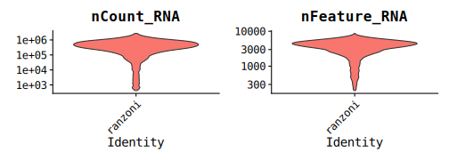
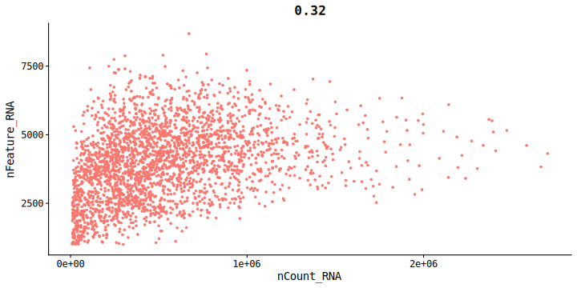
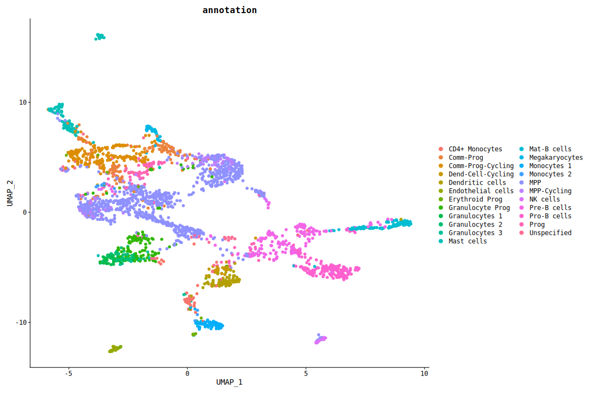
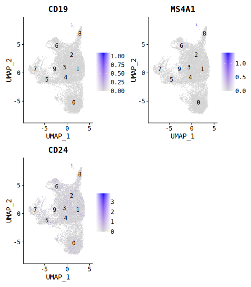

2023-12_Yang_hscs_integrative_analysis_ranzoni
================

## Setup

``` r
# install.packages("Seurat")
# install.packages("remotes")
# BiocManager::install(version = '3.16')
# BiocManager::install("glmGamPoi")
# remotes::install_github("stephenturner/annotables")
# install.packages("glmGamPoi")
# BiocManager::install("DESeq2")
# BiocManager::install("MAST") <- Doesn't work
# remotes::install_github("RGLab/MAST")
# install.packages("data.filt")
# remotes::install_github("sonejilab/cellexalvrR") <- Something Yang wanted to try
# remotes::install_github("mojaveazure/seurat-disk")

library(Seurat)
library(dplyr)
library(data.table)
library(Matrix)
library(ggplot2)
library(scales) # to better customize Seurat's plots
library(ggpubr)
library(ggrepel)
library(patchwork)
library(ggbeeswarm) # for better positioning of arrows on log2 change plots - position_jitter doesn't allow to mark points
library(future)
library(annotables) # for turning Ensembl ID to symbol
library(sctransform) # for normalization  
library(glmGamPoi) # for SCTransform
# library(svglite) # for vectorized, lightweight plotting
library(systemfonts) # to set the font for svg outputs
# library(DESeq2)
library(MAST)
# library(cellexalvrR) <- Something Yang wanted to try
library(SeuratDisk)

"%notin%" <- Negate("%in%")
"%notlike%" <- Negate("%like%")


# set the theme for plotting (Seurat uses ggplot's themes)
theme_set(new = theme_classic())
theme_update(
  axis.text.x = element_text(vjust = 0.5),
  strip.background = element_rect(fill = '#FFFFFF'),
  plot.title = element_text(hjust = 0.5, size = 25),
  plot.subtitle = element_text(size = 20, hjust = .5),
  axis.title = element_text(size = 23),
  axis.text = element_text(size = 20),
  legend.text = element_text(size = 18),
  legend.key.size = unit(2, 'line'),
  legend.title = element_text(size = 20, hjust = .5, vjust = .5)
  # text = element_text(family= "mono")
)

# That's not necessary (rmarkdown sets its directory as the one the .Rmd file is in.)
wd <- "/disk2/user/radgro/projects/2023-09_Yang_hsc/"
knitr::opts_knit$set(root.dir = wd)

fonts <- list(
  mono = "Consolas",
  sans = "Consolas"
)

# set svglite as a default for all the plots
# knitr::opts_chunk$set(knitr.chunk.dev = 'svglite')
# knitr::opts_chunk$set(dev = 'svglite', system_fonts = fonts)
knitr::opts_chunk$set(dev = 'svglite', dev.args = list(system_fonts = fonts),
                      cache.path = "2023-12_Yang_hsc_integrative_analysis_ranzoni_files/gfm", cache = F,
                      cache.lazy = FALSE) # cache of a github_document doesn't work if the path to the gfm folder is not provided!!!

# knitr::opts_chunk$set(cache.extra = 1) # RESETS CACHE

# plan("multicore", workers = 8) # Not allowed on the server
# plan()
```

### Load HSCs data

``` r
hsc_s <- LoadH5Seurat("data/hsc_final.h5Seurat")
```

### Integrate data from ranzoni et al.

### load ranzoni et al. - initial data after merge

``` r
# ranzoni <- Read10X(data.dir = "data/ranzoni_et_al/annotated_cells/matrix_files_annotated/", gene.column = 1)

ranzoni <- ReadMtx("data/ranzoni_et_al/initial_merged_data_matrix/sparse_matrix.mtx.gz",
        "data/ranzoni_et_al/initial_merged_data_matrix/barcodes.tsv.gz",
        "data/ranzoni_et_al/initial_merged_data_matrix/features.tsv.gz", 
        feature.column = 1)
```

Join gene names with gene symbols and change symbols for Geneids when
the grch38 doesn’t include any particular ID, mult set to ‘first’, to
exclude duplicates/synonyms. Gene symbols from annotables package.

``` r
gt <- data.table("Geneid" = rownames(ranzoni)) # gene title

gt_s <- setDT(grch38[, c("ensgene", "symbol")])
colnames(gt_s)[1] <- "Geneid"

gt_join <- gt_s[gt, on = .(Geneid), mult = 'first'][symbol %in% NA | symbol == "", symbol := Geneid]
gt_sym <- gt_join[, symbol]
```

Insert joined gene names and symbols into datasets.

``` r
rownames(ranzoni) <- gt_sym

rm(list = c("gt", "gt_s", "gt_sym"))
```

``` r
ranzoni_s <- CreateSeuratObject(ranzoni, project = "ranzoni")
rm(ranzoni)
```

### Label cells with cluster names from ranzoni et al.

``` r
ranz_meta <- fread("data/ranzoni_et_al/annotated_cells/annotated_metadata.csv")
ranz_meta <- ranz_meta[, .(CELL_NAME, annotation, Cluster)]
```

#### Check order of cells in metadata table and dataset

``` r
table(colnames(ranzoni_s) == ranz_meta$CELL_NAME)
```

    ## 
    ## TRUE 
    ## 4504

#### Add the metadata to the SeuratObject

``` r
ranzoni_s$annotation <- ranz_meta$annotation
ranzoni_s$cluster_ranz <- ranz_meta$Cluster
```

### QC and filtering

``` r
print("nCount_RNA")
```

    ## [1] "nCount_RNA"

``` r
length(WhichCells(ranzoni_s, expression = nCount_RNA > 10000))
```

    ## [1] 4203

``` r
length(WhichCells(ranzoni_s, expression = nCount_RNA < 10000))
```

    ## [1] 301

``` r
print("nFeature_RNA")
```

    ## [1] "nFeature_RNA"

``` r
length(WhichCells(ranzoni_s, expression = nFeature_RNA > 1000))
```

    ## [1] 4109

``` r
length(WhichCells(ranzoni_s, expression = nFeature_RNA < 1000))
```

    ## [1] 395

``` r
ranzoni_s <- PercentageFeatureSet(ranzoni_s, pattern = "^MT-", col.name = "percent_mt")
ranzoni_s <- PercentageFeatureSet(ranzoni_s, "^RP[SL]", col.name = "percent_ribo")
ranzoni_s <- PercentageFeatureSet(ranzoni_s, "^HB[^(P)]", col.name = "percent_hb")
ranzoni_s <- PercentageFeatureSet(ranzoni_s, "PECAM1|PF4", col.name = "percent_plat")
```

``` r
VlnPlot(ranzoni_s, features = c('nCount_RNA','nFeature_RNA'), pt.size = 0, raster = F, log = T) +  NoLegend()
```

<!-- -->

``` r
VlnPlot(ranzoni_s, features = c('nCount_RNA','nFeature_RNA', 'percent_mt', 'percent_hb', "percent_ribo", "percent_plat"), pt.size = 0, raster = F) +  NoLegend()
```

<!-- -->

``` r
ranzoni_s <- subset(x = ranzoni_s, subset = nCount_RNA > 10000 & nFeature_RNA > 1000 & percent_mt < 18 & percent_hb < 10)
```

#### Further QC

``` r
FeatureScatter(ranzoni_s, "nCount_RNA", "nFeature_RNA", pt.size = 1, plot.cor = T) + scale_x_continuous(labels = scales::scientific) + NoLegend()
```

<!-- -->

``` r
counts_cells <- ranzoni_s@assays$RNA@counts
counts_cells <- Matrix::t(Matrix::t(counts_cells)/Matrix::colSums(counts_cells)) * 100

most_expr_cells <- order(apply(counts_cells, 1, median), decreasing = T)[20:1]
most_expr_counts_cells <- as.matrix(t(counts_cells[most_expr_cells,]))

rm(list = c("counts_cells", "most_expr_cells"))
par(mar=c(5, 6, 1, 2))
boxplot(most_expr_counts_cells, cex = 1, las = 1, xlab = "% total count per cell",
        col = (scales::hue_pal())(20)[20:1], horizontal = TRUE)
```

<!-- -->

### Clustering analysis before integration

``` r
ranzoni_s <- SCTransform(ranzoni_s, vst.flavor = "v2", verbose = FALSE) %>%
  RunPCA(npcs = 30, verbose = FALSE) %>%
  RunUMAP(reduction = "pca", dims = 1:30, verbose = FALSE)
```

Data allows to stratify cells according to their identity.

``` r
DimPlot(ranzoni_s, pt.size = 2, group.by = "annotation")
```

<!-- -->

#### remove ribosomal genes - obsolete

``` r
counts_ranzoni <- GetAssayData(ranzoni_s, assay = "RNA") # get the matrix from the assay data
ribo_ranzoni <- which(rownames(counts_ranzoni) %like% "^RP[SL]") # find row numbers of ribosomal genes

counts_ranzoni <- counts_ranzoni[-ribo_ranzoni,]

ranzoni_s <- subset(ranzoni_s, features = rownames(counts_ranzoni))
```

#### Removal of genes not present in the 10X panel used with the initial dataset - ranzoni

``` r
panel_10x <- fread("data/gene_list_10X_panel.txt", header = F)
counts_ranzoni <- GetAssayData(ranzoni_s, assay = "RNA") # get the matrix from the assay data
# get the indices of genes present in the 10X panel
in_panel_10x <- which(rownames(ranzoni_s@assays$RNA) %in% panel_10x[, V1])

counts_ranzoni <- counts_ranzoni[in_panel_10x,]

# counts_ranzoni <- counts_ranzoni[-hsc_counts_0,]
ranzoni_s <- subset(ranzoni_s, features = rownames(counts_ranzoni))
```

``` r
# HSCs dataset
print("HSC dataset")
```

    ## [1] "HSC dataset"

``` r
length(which(rownames(hsc_s@assays$RNA) %in% panel_10x[, V1]))
```

    ## [1] 18533

``` r
#ranzoni et al.
print("ranzoni dataset")
```

    ## [1] "ranzoni dataset"

``` r
length(which(rownames(ranzoni_s@assays$RNA) %in% panel_10x[, V1]))
```

    ## [1] 17005

### Clustering analysis after removing genes out of the 10X panel

``` r
ranzoni_s <- SCTransform(ranzoni_s, vst.flavor = "v2", verbose = FALSE) %>%
  RunPCA(npcs = 30, verbose = FALSE) %>%
  RunUMAP(reduction = "pca", dims = 1:30, verbose = FALSE)
```

**Removing of genes resulted in mapping of negligibly worse
resolution.**

``` r
DimPlot(ranzoni_s, pt.size = 2, group.by = "annotation")
```

<!-- -->

## Integration

``` r
integration_list <- list(ranzoni_s, hsc_s)

features <- SelectIntegrationFeatures(object.list = integration_list, nfeatures = 3000)
integration_list <- PrepSCTIntegration(object.list = integration_list, anchor.features = features)
integration_anchors <- FindIntegrationAnchors(object.list = integration_list, anchor.features = features, normalization.method = "SCT")


hsc_ranzoni <- IntegrateData(anchorset = integration_anchors, new.assay.name = "integrated", normalization.method = c("LogNormalize", "SCT"))
```

``` r
p1 <- VlnPlot(hsc_ranzoni, features = c("nCount_RNA", "nFeature_RNA"), group.by = "orig.ident", 
              log = T, slot = "scale.data", pt.size = 0)
p2 <- VlnPlot(hsc_ranzoni, features = c("nCount_SCT", "nFeature_SCT"), group.by = "orig.ident", 
              slot = "scale.data", pt.size = 0)

ggarrange(p1, p2, ncol = 1)
```

<!-- -->

### Dim Reduc

**Don’t run SCT after integration!!!**

``` r
DefaultAssay(hsc_ranzoni) <- "integrated"

# hsc_ranzoni <- SCTransform(hsc_ranzoni, vst.flavor = "v2", verbose = FALSE) %>%
#   RunPCA( npcs = 30, verbose = FALSE) %>%
#   RunUMAP(reduction = "pca", dims = 1:30, verbose = FALSE)
hsc_ranzoni <-  ScaleData(hsc_ranzoni) %>%
  RunPCA(npcs = 30, verbose = FALSE) %>%
  RunUMAP(reduction = "pca", dims = 1:30, verbose = FALSE)
```

``` r
p1 <- VlnPlot(hsc_ranzoni, features = c("nCount_RNA", "nFeature_RNA"), group.by = "orig.ident", 
              log = T, pt.size = 0)
p2 <- VlnPlot(hsc_ranzoni, features = c("nCount_SCT", "nFeature_SCT"), group.by = "orig.ident", pt.size = 0)

ggarrange(p1, p2, ncol = 1)
```

<!-- -->

#### UMAP

**DIfferent color scheme**

``` r
c25 <- c(
  "dodgerblue2", "#E31A1C", # red
  "green4",
  "#6A3D9A", # purple
  "#FF7F00", # orange
  "gold1",
  "skyblue2", "#FB9A99", # lt pink
  "palegreen2",
  "#CAB2D6", # lt purple
  "#FDBF6F", # lt orange
  "gray70", "khaki2",
  "maroon", "orchid1", "deeppink1", "blue1", "steelblue4",
  "darkturquoise", "green1", "yellow4", "yellow3",
  "darkorange4", "brown"
)


# Annotate Yang's HSCs
annot_hsc_ranz <- as.data.table(hsc_ranzoni@meta.data$annotation)
annot_hsc_ranz[V1 %in% NA, V1 := "Yang"]
hsc_ranzoni@meta.data$annotation <- annot_hsc_ranz$V1

cluster_hsc_ranz <- as.data.table(hsc_ranzoni@meta.data$seurat_clusters)
cluster_hsc_ranz[V1 %in% NA, V1 := "Ranzoni"]
hsc_ranzoni@meta.data$seurat_clusters <- cluster_hsc_ranz$V1


order <- unique(hsc_ranzoni@meta.data$annotation)


DimPlot(hsc_ranzoni, group.by = c("seurat_clusters", "annotation"), pt.size = 2, order = order, 
        label = T, repel = T, label.size = 5, label.box = T,
        cols = c25) 
```

<!-- -->

##### Validation of some of the overlaps

###### Megakaryocytes

``` r
# colors <- c(hue_pal(h = c(50,300), l = 70)(8), "green", "pink", "red")

FeaturePlot(hsc_s, features = c("ITGA2B", "VWF"), pt.size = 1, label = T, label.size = 4, order = T, raster = T)
```

<!-- -->

###### Granulocytes

``` r
# colors <- c(hue_pal(h = c(50,300), l = 70)(8), "green", "pink", "red")

FeaturePlot(hsc_s, features = c("IL5RA", "CXCR2", "ANPEP", "ITGB2"), pt.size = 1, label = T, label.size = 4, order = T, raster = T)
```

<!-- -->

###### B-cells and pro-B-cells

``` r
# colors <- c(hue_pal(h = c(50,300), l = 70)(8), "green", "pink", "red")

FeaturePlot(hsc_s, features = c("CD19", "MS4A1", "CD24"), pt.size = 1, label = T, label.size = 4, order = T, raster = T)
```

<!-- -->

###### NK cells

``` r
# colors <- c(hue_pal(h = c(50,300), l = 70)(8), "green", "pink", "red")

FeaturePlot(hsc_s, features = c("CD7", "NCAM1"), pt.size = 1, label = T, label.size = 4, order = T)
```

<!-- -->

``` r
knitr::knit_exit()
```
