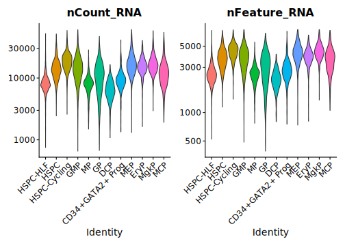

2024-01\_integrative\_analysis\_sakurai
================

## Description

Seurat data integration of healthy adult donor CD34 enriched PBMCs with
data from Sakurai et
al. (<https://www.nature.com/articles/s41586-023-05739-9>).

## Setup

``` r
# install.packages("Seurat")
# install.packages("remotes")
# BiocManager::install(version = '3.16')
# BiocManager::install("glmGamPoi")
# remotes::install_github("stephenturner/annotables")
# install.packages("glmGamPoi")
# BiocManager::install("DESeq2")
# BiocManager::install("MAST") <- Doesn't work
# remotes::install_github("RGLab/MAST")
# install.packages("data.filt")
# remotes::install_github("sonejilab/cellexalvrR") <- Something Yang wanted to try
# remotes::install_github("mojaveazure/seurat-disk")

library(Seurat)
library(dplyr)
library(data.table)
library(Matrix)
library(ggplot2)
library(scales) # to better customize Seurat's plots
library(ggpubr)
library(ggrepel)
library(patchwork)
library(ggbeeswarm) # for better positioning of arrows on log2 change plots - position_jitter doesn't allow to mark points
# library(future) # for parallelization
library(annotables) # for turning Ensembl ID to symbol
library(sctransform) # for normalization  
library(glmGamPoi) # for SCTransform
# library(svglite) # for vectorized, lightweight plotting
library(systemfonts) # to set the font for svg outputs
# library(DESeq2)
library(MAST)
# library(cellexalvrR) <- Something Yang wanted to try
library(SeuratDisk)

"%notin%" <- Negate("%in%")
"%notlike%" <- Negate("%like%")


# set the theme for plotting (Seurat uses ggplot's themes)
theme_set(new = theme_classic())
theme_update(
  axis.text.x = element_text(vjust = 0.5),
  strip.background = element_rect(fill = '#FFFFFF'),
  plot.title = element_text(hjust = 0.5, size = 25),
  plot.subtitle = element_text(size = 20, hjust = .5),
  axis.title = element_text(size = 23),
  axis.text = element_text(size = 20),
  legend.text = element_text(size = 18),
  legend.key.size = unit(2, 'line'),
  legend.title = element_text(size = 20, hjust = .5, vjust = .5)
  # text = element_text(family= "mono")
)

# That's not necessary (rmarkdown sets its directory as the one the .Rmd file is in.)
wd <- "/disk2/user/radgro/projects/2023-09_Yang_hsc/"
knitr::opts_knit$set(root.dir = wd)
# setwd(wd)

fonts <- list(
  mono = "Lato",
  sans = "Lato"
)

# set svglite as a default for all the plots
# knitr::opts_chunk$set(knitr.chunk.dev = 'svglite')
# knitr::opts_chunk$set(dev = 'svglite', system_fonts = fonts)
knitr::opts_chunk$set(dev = 'svglite', dev.args = list(system_fonts = fonts),
                      cache.path = "/disk2/user/radgro/projects/2023-09_Yang_hsc/2024-01_integrative_analysis_sakurai_files/gfm", 
                      cache = F,
                      cache.lazy = FALSE) # cache of a github_document doesn't work if the path to the gfm folder is not provided!!!

# knitr::opts_chunk$set(cache.extra = 1) # RESETS CACHE

# plan("multicore", workers = 8) # Not allowed on the server
# plan()
```

## Load data

### Our HSCs

``` r
hsc_s <- LoadH5Seurat("data/hsc_final.h5Seurat")
```

    ## Validating h5Seurat file

    ## Initializing RNA with data

    ## Adding counts for RNA

    ## Adding miscellaneous information for RNA

    ## Initializing SCT with data

    ## Adding counts for SCT

    ## Adding scale.data for SCT

    ## Adding variable feature information for SCT

    ## Adding miscellaneous information for SCT

    ## Adding reduction pca

    ## Adding cell embeddings for pca

    ## Adding feature loadings for pca

    ## Adding miscellaneous information for pca

    ## Adding reduction umap

    ## Adding cell embeddings for umap

    ## Adding miscellaneous information for umap

    ## Adding graph SCT_nn

    ## Adding graph SCT_snn

    ## Adding command information

    ## Adding cell-level metadata

    ## Adding miscellaneous information

    ## Adding tool-specific results

### Sakurai et al.

Load the Seurat object with finalized analysis downloaded from
<https://ftp.ncbi.nlm.nih.gov/geo/series/GSE192nnn/GSE192519/suppl/GSE192519%5FIntegrated%5FhHSC%2Erds%2Egz>.

``` r
sakurai_s <- readRDS("2024-01_integrative_analysis_sakurai/data/GSE192519_Integrated_hHSC.rds")
```

## QC

``` r
VlnPlot(sakurai_s, features = c('nCount_RNA','nFeature_RNA'), pt.size = 0, raster = F, log = T) +  NoLegend()
```

<!-- -->

``` r
FeatureScatter(sakurai_s, "nCount_RNA", "nFeature_RNA", pt.size = 1, plot.cor = T) + scale_x_continuous(labels = scales::scientific) + NoLegend()
```

<!-- -->

``` r
counts_cells <- sakurai_s@assays$RNA@counts
counts_cells <- Matrix::t(Matrix::t(counts_cells)/Matrix::colSums(counts_cells)) * 100

most_expr_cells <- order(apply(counts_cells, 1, median), decreasing = T)[20:1]
```

    ## Warning in asMethod(object): sparse->dense coercion: allocating vector of size
    ## 3.8 GiB

``` r
most_expr_counts_cells <- as.matrix(t(counts_cells[most_expr_cells,]))

rm(list = c("counts_cells", "most_expr_cells"))
par(mar=c(5, 6, 1, 2))
boxplot(most_expr_counts_cells, cex = 1, las = 1, xlab = "% total count per cell",
        col = (scales::hue_pal())(20)[20:1], horizontal = TRUE)
```

<!-- -->
\#\#\# Clusters before gene removal

``` r
DimPlot(sakurai_s, label = T)
```

<!-- -->

## Removal of genes not present in the 10X panel used with the initial dataset - sakurai

``` r
panel_10x <- fread("data/gene_list_10X_panel.txt", header = F)
counts_sakurai <- GetAssayData(sakurai_s, assay = "RNA") # get the matrix from the assay data
# get the indices of genes present in the 10X panel
in_panel_10x <- which(rownames(sakurai_s@assays$RNA) %in% panel_10x[, V1])

counts_sakurai <- counts_sakurai[in_panel_10x,]

# counts_sakurai <- counts_sakurai[-hsc_counts_0,]
sakurai_s <- subset(sakurai_s, features = rownames(counts_sakurai))
```

``` r
# HSCs dataset
print("HSC dataset")
```

    ## [1] "HSC dataset"

``` r
length(which(rownames(hsc_s@assays$RNA) %in% panel_10x[, V1]))
```

    ## [1] 18533

``` r
#sakurai et al.
print("sakurai dataset")
```

    ## [1] "sakurai dataset"

``` r
length(which(rownames(sakurai_s@assays$RNA) %in% panel_10x[, V1]))
```

    ## [1] 15229

### Clustering analysis after removing genes out of the 10X panel

``` r
sakurai_s <- SCTransform(sakurai_s, vst.flavor = "v2", verbose = FALSE) %>%
  RunPCA(npcs = 30, verbose = FALSE) %>%
  RunUMAP(reduction = "pca", dims = 1:30, verbose = FALSE)
```

**Removing of genes resulted in mapping of negligibly worse
resolution.**

``` r
DimPlot(sakurai_s, label = T)
```

<!-- -->

## Integration

``` r
integration_list <- list(sakurai_s, hsc_s)

features <- SelectIntegrationFeatures(object.list = integration_list, nfeatures = 3000)
integration_list <- PrepSCTIntegration(object.list = integration_list, anchor.features = features)
integration_anchors <- FindIntegrationAnchors(object.list = integration_list, anchor.features = features, normalization.method = "SCT")


hsc_sakurai <- IntegrateData(anchorset = integration_anchors, new.assay.name = "integrated", normalization.method = c("LogNormalize", "SCT"))
```

``` r
p1 <- VlnPlot(hsc_sakurai, features = c("nCount_RNA", "nFeature_RNA"), group.by = "orig.ident", 
              log = T, slot = "scale.data", pt.size = 0)
p2 <- VlnPlot(hsc_sakurai, features = c("nCount_SCT", "nFeature_SCT"), group.by = "orig.ident", 
              slot = "scale.data", pt.size = 0)

ggarrange(p1, p2, ncol = 1)
```

<!-- -->

### Dim Reduc

``` r
DefaultAssay(hsc_sakurai) <- "integrated"

# hsc_sakurai <- SCTransform(hsc_sakurai, vst.flavor = "v2", verbose = FALSE) %>%
#   RunPCA( npcs = 30, verbose = FALSE) %>%
#   RunUMAP(reduction = "pca", dims = 1:30, verbose = FALSE)
hsc_sakurai <-  ScaleData(hsc_sakurai) %>%
  RunPCA(npcs = 20, verbose = FALSE) %>%
  RunUMAP(reduction = "pca", dims = 1:20, verbose = FALSE)
```

``` r
ElbowPlot(hsc_sakurai, ndims = 30)
```

    ## Warning in ElbowPlot(hsc_sakurai, ndims = 30): The object only has information
    ## for 20 reductions

<!-- -->

#### UMAP

``` r
annot_hsc_sak <- as.data.table(hsc_sakurai@meta.data$old.ident)
annot_hsc_sak[V1 %in% NA, V1 := "Yang"]
annot_hsc_sak[V1 %notin% "Yang", V1 := "Sakurai"]
hsc_sakurai@meta.data$source <- annot_hsc_sak$V1

cluster_hsc_sak <- as.data.table(hsc_sakurai@meta.data$seurat_clusters)c
cluster_hsc_sak[V1 %in% NA, V1 := "sakurai"]
hsc_sakurai@meta.data$seurat_clusters <- cluster_hsc_sak$V1

order <- unique(hsc_sakurai@meta.data$annotation)

DimPlot(hsc_sakurai, pt.size = 2, label = T, repel = T, label.size = 6, label.box = T) 
# LabelClusters(umap_hsc_sak, id =  color = unique(ggplot_build(umap_hsc_sak)$data[[1]]$colour), size = 5, repel = T,  box.padding = 1)
```

``` r
c25 <- c(
  "dodgerblue2",
  "#E31A1C", # red
  "green4",
  "#6A3D9A", # purple
  "#FF7F00", # orange
  "gold1",
  "skyblue2", "#FB9A99", # lt pink
  "palegreen2",
  "#CAB2D6", # lt purple
  "#FDBF6F",  # lt orange
  "gray70", "khaki2",
  "maroon", "orchid1", "deeppink1", "blue1", "steelblue4",
  "darkturquoise", "green1", "yellow4", "yellow3",
  "darkorange4", "brown", "darkorange"
)


# Annotate Yang's HSCs
annot_hsc_sak <- as.data.table(hsc_sakurai@active.ident)
annot_hsc_sak[V1 %notin% seq(0, 9), V1 := "Sakurai"]
hsc_sakurai@meta.data$our_clusters <- droplevels((annot_hsc_sak$V1))

# annotated Sakurai's HSCs
annot_hsc_sak <- as.data.table(hsc_sakurai@active.ident)
annot_hsc_sak[V1 %in% seq(0, 9), V1 := "Yang"]
hsc_sakurai@meta.data$Sakurai_clusters <- annot_hsc_sak$V1

order <- levels(hsc_sakurai@meta.data$our_clusters)


DimPlot(hsc_sakurai, group.by = c("our_clusters", "Sakurai_clusters"), pt.size = .4, order = order,
        label = T, repel = F, label.size = 4, label.box = T,
        cols = alpha(c25, .9))
```

<!-- -->

``` r
sessionInfo()
```

    ## R version 4.2.3 (2023-03-15)
    ## Platform: x86_64-pc-linux-gnu (64-bit)
    ## Running under: Ubuntu 20.04.6 LTS
    ## 
    ## Matrix products: default
    ## BLAS:   /usr/lib/x86_64-linux-gnu/blas/libblas.so.3.9.0
    ## LAPACK: /usr/lib/x86_64-linux-gnu/lapack/liblapack.so.3.9.0
    ## 
    ## locale:
    ##  [1] LC_CTYPE=en_US.UTF-8       LC_NUMERIC=C              
    ##  [3] LC_TIME=en_US.UTF-8        LC_COLLATE=en_US.UTF-8    
    ##  [5] LC_MONETARY=en_US.UTF-8    LC_MESSAGES=en_US.UTF-8   
    ##  [7] LC_PAPER=en_US.UTF-8       LC_NAME=C                 
    ##  [9] LC_ADDRESS=C               LC_TELEPHONE=C            
    ## [11] LC_MEASUREMENT=en_US.UTF-8 LC_IDENTIFICATION=C       
    ## 
    ## attached base packages:
    ## [1] stats4    stats     graphics  grDevices utils     datasets  methods  
    ## [8] base     
    ## 
    ## other attached packages:
    ##  [1] SeuratDisk_0.0.0.9021       MAST_1.25.2                
    ##  [3] SingleCellExperiment_1.20.1 SummarizedExperiment_1.24.0
    ##  [5] Biobase_2.58.0              GenomicRanges_1.46.1       
    ##  [7] GenomeInfoDb_1.30.1         IRanges_2.28.0             
    ##  [9] S4Vectors_0.36.2            BiocGenerics_0.44.0        
    ## [11] MatrixGenerics_1.10.0       matrixStats_1.0.0          
    ## [13] systemfonts_1.0.4           glmGamPoi_1.12.1           
    ## [15] sctransform_0.3.5           annotables_0.2.0           
    ## [17] ggbeeswarm_0.7.2            patchwork_1.1.1            
    ## [19] ggrepel_0.9.3               ggpubr_0.6.0               
    ## [21] scales_1.2.1                ggplot2_3.4.2              
    ## [23] Matrix_1.6-1.1              data.table_1.14.8          
    ## [25] dplyr_1.1.2                 SeuratObject_4.1.3         
    ## [27] Seurat_4.3.0               
    ## 
    ## loaded via a namespace (and not attached):
    ##   [1] backports_1.4.1        plyr_1.8.8             igraph_1.5.1          
    ##   [4] lazyeval_0.2.2         sp_2.0-0               splines_4.2.3         
    ##   [7] listenv_0.9.0          scattermore_0.8        digest_0.6.33         
    ##  [10] htmltools_0.5.6        fansi_1.0.4            magrittr_2.0.3        
    ##  [13] tensor_1.5             cluster_2.1.4          ROCR_1.0-11           
    ##  [16] globals_0.16.2         svglite_2.1.1          spatstat.sparse_3.0-2 
    ##  [19] colorspace_2.1-0       xfun_0.40              crayon_1.5.2          
    ##  [22] RCurl_1.98-1.12        jsonlite_1.8.7         progressr_0.14.0      
    ##  [25] spatstat.data_3.0-1    survival_3.5-5         zoo_1.8-12            
    ##  [28] glue_1.6.2             polyclip_1.10-4        gtable_0.3.4          
    ##  [31] zlibbioc_1.44.0        XVector_0.34.0         leiden_0.3.9          
    ##  [34] DelayedArray_0.20.0    car_3.1-2              future.apply_1.8.1    
    ##  [37] abind_1.4-5            rstatix_0.7.2          spatstat.random_3.1-5 
    ##  [40] miniUI_0.1.1.1         Rcpp_1.0.11            viridisLite_0.4.2     
    ##  [43] xtable_1.8-4           reticulate_1.24        bit_4.0.5             
    ##  [46] htmlwidgets_1.5.4      httr_1.4.7             RColorBrewer_1.1-3    
    ##  [49] ellipsis_0.3.2         ica_1.0-3              farver_2.1.1          
    ##  [52] pkgconfig_2.0.3        uwot_0.1.14            deldir_1.0-9          
    ##  [55] utf8_1.2.3             labeling_0.4.2         tidyselect_1.2.0      
    ##  [58] rlang_1.1.1            reshape2_1.4.4         later_1.3.1           
    ##  [61] munsell_0.5.0          tools_4.2.3            cli_3.6.1             
    ##  [64] generics_0.1.3         broom_0.7.12           ggridges_0.5.3        
    ##  [67] evaluate_0.21          stringr_1.5.0          fastmap_1.1.1         
    ##  [70] yaml_2.3.7             goftest_1.2-3          bit64_4.0.5           
    ##  [73] knitr_1.44             fitdistrplus_1.1-6     purrr_1.0.1           
    ##  [76] RANN_2.6.1             pbapply_1.7-2          future_1.33.0         
    ##  [79] nlme_3.1-163           mime_0.12              ggrastr_1.0.2         
    ##  [82] hdf5r_1.3.8            compiler_4.2.3         beeswarm_0.4.0        
    ##  [85] plotly_4.10.2          png_0.1-8              ggsignif_0.6.4        
    ##  [88] spatstat.utils_3.0-3   tibble_3.2.1           stringi_1.7.12        
    ##  [91] lattice_0.21-8         vctrs_0.6.3            pillar_1.9.0          
    ##  [94] lifecycle_1.0.3        spatstat.geom_3.2-4    lmtest_0.9-40         
    ##  [97] RcppAnnoy_0.0.21       cowplot_1.1.1          bitops_1.0-7          
    ## [100] irlba_2.3.5.1          httpuv_1.6.5           R6_2.5.1              
    ## [103] promises_1.2.0.1       KernSmooth_2.23-22     gridExtra_2.3         
    ## [106] vipor_0.4.5            parallelly_1.36.0      codetools_0.2-19      
    ## [109] MASS_7.3-60            withr_2.5.0            GenomeInfoDbData_1.2.9
    ## [112] parallel_4.2.3         grid_4.2.3             tidyr_1.3.0           
    ## [115] rmarkdown_2.11         carData_3.0-5          Rtsne_0.16            
    ## [118] spatstat.explore_3.2-1 shiny_1.7.4

``` r
knitr::knit_exit()
```
