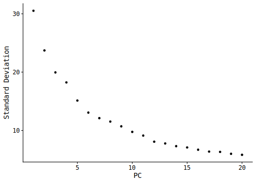
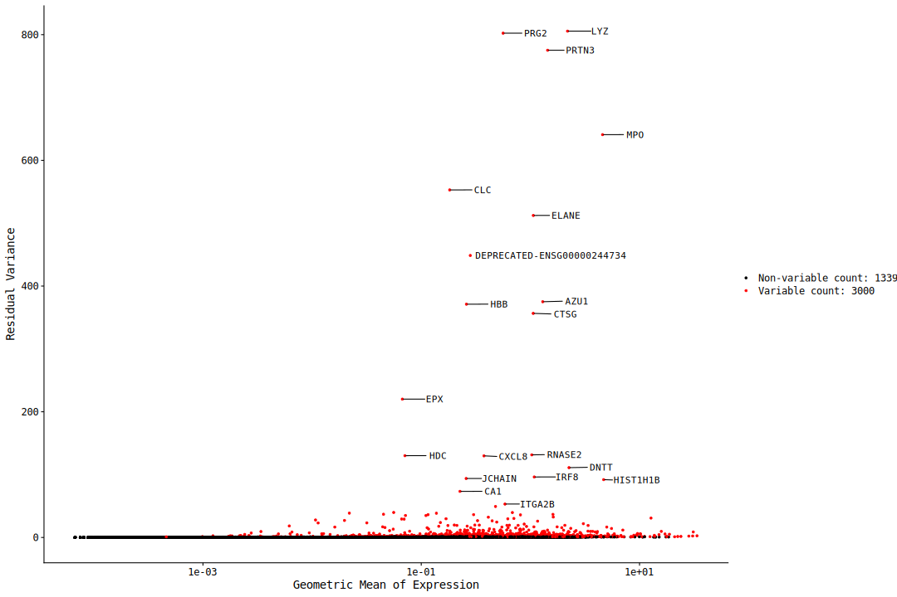

2024-07_yang_bone_marrow_qc
================

<body style="background-color:FloralWhite;">

# BM QC

**Analysis of data obtained with 10X Chromium Fixed RNA Kit, Human
Transcriptome.** - 4 healthy donors

``` r
# install.packages("Seurat")
# install.packages("remotes")
# install.packages("BiocManager")
# BiocManager::install(version = '3.18')
# BiocManager::install("glmGamPoi")
# remotes::install_github("stephenturner/annotables")
# install.packages("glmGamPoi")
# BiocManager::install("DESeq2")
# # BiocManager::install("MAST") # <- Doesn't work
# remotes::install_github("RGLab/MAST")
# # install.packages("data.filt")
# remotes::install_github("sonejilab/cellexalvrR") # <- Something Yang wanted to try
# remotes::install_github("mojaveazure/seurat-disk")

library(Seurat)
library(dplyr)
library(data.table)
library(Matrix)
library(ggplot2)
library(scales) # to better customize Seurat's plots
library(ggpubr)
library(ggrepel)
library(patchwork)
library(cowplot)
library(ggbeeswarm) # for better positioning of arrows on log2 change plots - position_jitter doesn't allow to mark points
library(future)
library(annotables) # for turning Ensembl ID to symbol
library(sctransform) # for normalization
library(glmGamPoi) # for SCTransform
library(svglite) # for vectorized, lightweight plotting
library(systemfonts) # to set the font for svg outputs
# library(DESeq2)
library(MAST)
# library(cellexalvrR) <- Something Yang wanted to try
library(SeuratDisk)

"%notin%" <- Negate("%in%")
"%notlike%" <- Negate("%like%")


# set the theme for plotting (Seurat uses ggplot's themes)
theme_set(new = theme_classic())
theme_update(
  axis.text.x = element_text(vjust = 0.5),
  strip.background = element_rect(fill = '#FFFFFF'),
  plot.title = element_text(hjust = 0.5, size = 25),
  plot.subtitle = element_text(size = 20, hjust = .5),
  axis.title = element_text(size = 23),
  axis.text = element_text(size = 20),
  legend.text = element_text(size = 18),
  legend.key.size = unit(2, 'line'),
  legend.title = element_text(size = 20, hjust = .5, vjust = .5)
  # text = element_text(family= "mono")
)

# That's not necessary (rmarkdown sets its directory as the one the .Rmd file is in.)
wd <- "/home/radgro/projects/2023-09_Yang_hsc/2024-07_bone_marrow/analysis/"
knitr::opts_knit$set(root.dir = wd)

fonts <- list(
  mono = "Consolas",
  sans = "Consolas"
)

# set svglite as a default for all the plots
# knitr::opts_chunk$set(knitr.chunk.dev = 'svglite')
# knitr::opts_chunk$set(dev = 'svglite', system_fonts = fonts)
knitr::opts_chunk$set(dev = 'svglite', dev.args = list(system_fonts = fonts),
                      cache.path = "2024-07_bone_marrow_qc/gfm", cache = F,
                      cache.lazy = FALSE) # cache of a github_document doesn't work if the path to the gfm folder is not provided!!!

# knitr::opts_chunk$set(cache.extra = 1) # RESETS CACHE

# plan("multicore", workers = 8) # Not allowed on the server
# plan()

options(future.globals.maxSize = 8000 * 1024^2) # for seurat's parallelization
```

``` r
# d like donor
d1 <- Read10X("../data/mtx_raw/A1/")
d1 <- CreateSeuratObject(d1, project = "a")
d2 <- Read10X("../data/mtx_raw/B1/")
d2 <- CreateSeuratObject(d2, project = "b")
d3 <- Read10X("../data/mtx_raw/C1//")
d3 <- CreateSeuratObject(d3, project = "c")
d4 <- Read10X("../data/mtx_raw/D1/")
d4 <- CreateSeuratObject(d4, project = "d")
```

## Merging without integration

``` r
hsc_bm <- merge(d1, y = d2)
hsc_bm <- merge(hsc_bm, y = d3)
hsc_bm <- merge(hsc_bm, y = d4)

# required in Seurat 5
hsc_bm <- JoinLayers(hsc_bm)

rm(list = c("d1", "d2", "d3", "d4"))
suppressMessages(gc())
```

    ##             used   (Mb) gc trigger    (Mb)   max used    (Mb)
    ## Ncells  10895288  581.9   18417671   983.7   18417671   983.7
    ## Vcells 391979000 2990.6 1852371202 14132.5 1890822381 14425.9

## QC and filtering of cells

### Plotting

#### Initial removal of empty droplets

``` r
table(hsc_bm$orig.ident)
```

    ## 
    ##      a      b      c      d 
    ## 550818 479458 633545 591297

``` r
VlnPlot(hsc_bm, features = c('nCount_RNA','nFeature_RNA'), split.by = "orig.ident", pt.size = 1, raster = F, log = T) +  NoLegend()
```

``` r
VlnPlot(hsc_bm, features = c('nCount_RNA','nFeature_RNA'),
        split.by = "orig.ident", pt.size = 0, raster = F, log = T ) +  NoLegend()
```

``` r
print("nCount_RNA - threshold 500")
```

    ## [1] "nCount_RNA - threshold 500"

``` r
length(WhichCells(hsc_bm, expression = nCount_RNA > 500))
```

    ## [1] 55187

``` r
length(WhichCells(hsc_bm, expression = nCount_RNA < 500))
```

    ## [1] 2199929

``` r
print("nFeature_RNA - threshold 500")
```

    ## [1] "nFeature_RNA - threshold 500"

``` r
length(WhichCells(hsc_bm, expression = nFeature_RNA > 500))
```

    ## [1] 54725

``` r
length(WhichCells(hsc_bm, expression = nFeature_RNA < 500))
```

    ## [1] 2200385

``` r
print("nCount_RNA - threshold 900")
```

    ## [1] "nCount_RNA - threshold 900"

``` r
length(WhichCells(hsc_bm, expression = nCount_RNA > 900))
```

    ## [1] 52901

``` r
length(WhichCells(hsc_bm, expression = nCount_RNA < 900))
```

    ## [1] 2202209

``` r
print("nFeature_RNA - threshold 900")
```

    ## [1] "nFeature_RNA - threshold 900"

``` r
length(WhichCells(hsc_bm, expression = nFeature_RNA > 900))
```

    ## [1] 51609

``` r
length(WhichCells(hsc_bm, expression = nFeature_RNA < 900))
```

    ## [1] 2203503

``` r
hsc_bm <- subset(x = hsc_bm, subset = nCount_RNA > 900 & nFeature_RNA > 900)
```

#### Other features

``` r
hsc_bm <- PercentageFeatureSet(hsc_bm, pattern = "^MT-", col.name = "percent_mt")
hsc_bm <- PercentageFeatureSet(hsc_bm, "^RP[SL]", col.name = "percent_ribo")
hsc_bm <- PercentageFeatureSet(hsc_bm, "^HB[^(P)]", col.name = "percent_hb")
hsc_bm <- PercentageFeatureSet(hsc_bm, "PECAM1|PF4", col.name = "percent_plat")
```

``` r
VlnPlot(hsc_bm, features = c('nCount_RNA','nFeature_RNA', 'percent_mt', 'percent_hb',
                             "percent_ribo", "percent_plat"),
        split.by = "orig.ident", pt.size = .5, raster = F) +  NoLegend()
```

    ## Warning: Default search for "data" layer in "RNA" assay yielded no results;
    ## utilizing "counts" layer instead.

    ## The default behaviour of split.by has changed.
    ## Separate violin plots are now plotted side-by-side.
    ## To restore the old behaviour of a single split violin,
    ## set split.plot = TRUE.
    ##       
    ## This message will be shown once per session.

    ## Warning in SingleExIPlot(type = type, data = data[, x, drop = FALSE], idents =
    ## idents, : All cells have the same value of percent_ribo.

<!-- -->

#### Filtering

``` r
hsc_bm <- subset(x = hsc_bm, subset = 100000 > nCount_RNA & percent_mt < 8)
```

``` r
FeatureScatter(hsc_bm, "nCount_RNA", "nFeature_RNA", pt.size = 1, plot.cor = T) + scale_x_continuous(labels = scales::scientific) + NoLegend()
```

<!-- -->

``` r
counts_cells <- hsc_bm@assays$RNA$counts
counts_cells <- Matrix::t(Matrix::t(counts_cells)/Matrix::colSums(counts_cells)) * 100

most_expr_cells <- order(apply(counts_cells, 1, median), decreasing = T)[20:1]
```

    ## Warning in asMethod(object): sparse->dense coercion: allocating vector of size
    ## 14.2 GiB

``` r
most_expr_counts_cells <- as.matrix(t(counts_cells[most_expr_cells,]))

rm(list = c("counts_cells", "most_expr_cells"))
par(mar=c(5, 5, 1, 1))
boxplot(most_expr_counts_cells, cex = 1, las = 1, xlab = "% total count per cell",
        col = (scales::hue_pal())(20)[20:1], horizontal = TRUE)
```

<!-- -->

## Clustering analysis

### Normalization, scaling and dimensionality reduction

**Normalization was done using the SC transform described here:
<https://genomebiology.biomedcentral.com/articles/10.1186/s13059-019-1874-1>
as it is supposed to be depth-independent, which justifies its use in
Smartseq3 EV sequencing.**

``` r
hsc_bm <- SCTransform(hsc_bm, vst.flavor = "v2", verbose = FALSE) %>%
  RunPCA(npcs = 30, verbose = FALSE) %>%
  RunUMAP(reduction = "pca", dims = 1:30, verbose = FALSE)
```

    ## Warning: The default method for RunUMAP has changed from calling Python UMAP via reticulate to the R-native UWOT using the cosine metric
    ## To use Python UMAP via reticulate, set umap.method to 'umap-learn' and metric to 'correlation'
    ## This message will be shown once per session

#### Elbow plot

``` r
ElbowPlot(hsc_bm)
```

<!-- -->

### Dim reduc

No batch effect seems to affect the data.

``` r
DimPlot(hsc_bm, group.by = "orig.ident", pt.size = 2, alpha = .3)
```

<!-- -->

``` r
DimPlot(hsc_bm, group.by = "orig.ident", pt.size = 2, alpha = .3, reduction = 'pca')
```

<!-- -->

``` r
DimPlot(hsc_bm, split.by = "orig.ident", pt.size = 2, group.by = "orig.ident", ncol = 2)
```

<!-- -->

``` r
DimPlot(hsc_bm, split.by = "orig.ident", pt.size = 2, group.by = "orig.ident", ncol = 2, reduction = 'pca')
```

<!-- -->

``` r
p <- FeaturePlot(hsc_bm, split.by = "orig.ident", pt.size = 2,
            features =  c("nCount_RNA", "nFeature_RNA"))

for(i in 1:8){p[[i]] <- p[[i]] +
  theme_void() +
  theme(plot.title = element_text(hjust = 0.5, size = 25),
        plot.subtitle = element_text(size = 20, hjust = .5),
        legend.title = element_text(size = 20, hjust = .5, vjust = .5)) +
  scale_color_gradient(trans = "log")
}
```

    ## Scale for colour is already present.
    ## Adding another scale for colour, which will replace the existing scale.
    ## Scale for colour is already present.
    ## Adding another scale for colour, which will replace the existing scale.
    ## Scale for colour is already present.
    ## Adding another scale for colour, which will replace the existing scale.
    ## Scale for colour is already present.
    ## Adding another scale for colour, which will replace the existing scale.
    ## Scale for colour is already present.
    ## Adding another scale for colour, which will replace the existing scale.
    ## Scale for colour is already present.
    ## Adding another scale for colour, which will replace the existing scale.
    ## Scale for colour is already present.
    ## Adding another scale for colour, which will replace the existing scale.
    ## Scale for colour is already present.
    ## Adding another scale for colour, which will replace the existing scale.

``` r
p
```

<!-- -->

## Variable features

``` r
# top variable cells
top_c <- head(VariableFeatures(hsc_bm), 20) # No need to use FindVariableFeatures, as SCTransform does that

p_var_c <- VariableFeaturePlot(hsc_bm)
LabelPoints(p_var_c, points = top_c, repel = T)
```

    ## When using repel, set xnudge and ynudge to 0 for optimal results

<!-- -->

``` r
FeaturePlot(hsc_bm, features = c("nCount_RNA", "nFeature_RNA", top_c[1:10]))
```

<!-- -->

``` r
FeaturePlot(hsc_bm, features = c("nCount_RNA", "nFeature_RNA", top_c[11:20]))
```

<!-- -->

## Genes of interest

``` r
int_goi <- read.csv2("../../data/integrin_gene_list_edited.csv", header = F)
# save the list as a vector
int_goi <- int_goi[,1]
```

``` r
FeaturePlot(hsc_bm, features = c("CD34", "ITGA2", int_goi[1:14]))
```

    ## Warning: No layers found matching search pattern provided
    ## Warning: No layers found matching search pattern provided

    ## Warning: The following requested variables were not found: Itga2, ITGAE

<!-- -->

``` r
FeaturePlot(hsc_bm, features = c("CD34", "ITGA2", int_goi[15:27]))
```

    ## Warning: No layers found matching search pattern provided
    ## Warning: No layers found matching search pattern provided

    ## Warning: The following requested variables were not found: ITGB6, VLA-4

<!-- -->
